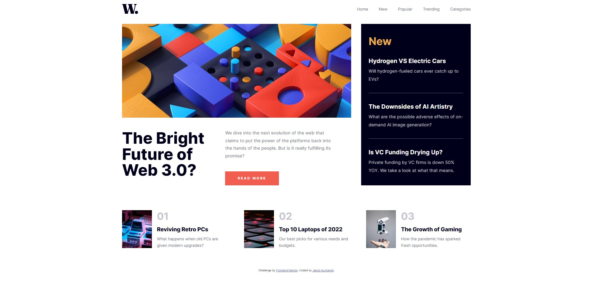

# Frontend Mentor - News homepage solution

This is a solution to the [News homepage challenge on Frontend Mentor](https://www.frontendmentor.io/challenges/news-homepage-H6SWTa1MFl). Frontend Mentor challenges help you improve your coding skills by building realistic projects.

### The challenge

Users should be able to:

- View the optimal layout for the interface depending on their device's screen size
- See hover and focus states for all interactive elements on the page

### Screenshot

### Links

- Solution URL: [Solution](https://www.frontendmentor.io/solutions/news-homepage-main-grid-flexbox-sassscss-bem-MwZGdc3vfj)
- Live Site URL: [Live](https://kucharzooo.github.io/news-homepage-news/)

### Built with

- Semantic HTML5 markup
- CSS custom properties
- Flexbox
- CSS Grid
- Mobile-first workflow
- BEM
- SASS/SCSS

## Author

- Website - [Jakub Kucharski](https://github.com/Kucharzooo)
- Frontend Mentor - [@kucharzooo](https://www.frontendmentor.io/profile/Kucharzooo)
